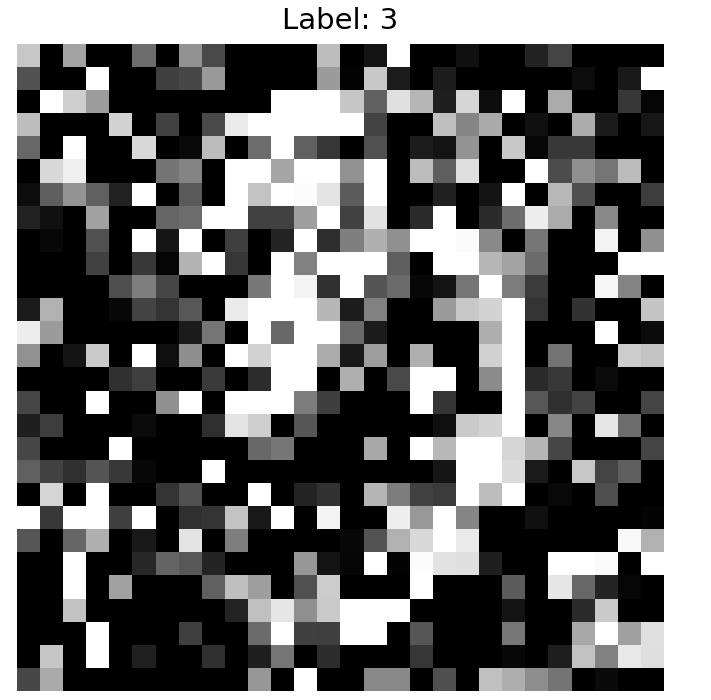

<div align="center">

#  Assignment 2: 手写体分类任务

[](https://www.python.org/)
[](http://101.132.193.95:3000)
[](LICENSE)

**📅 截止日期：11月10日** | **🏆 [查看排行榜](http://101.132.193.95:3000)**


---

</div>

## 📋 任务概述

> 本次任务是一个手写数字分类任务，要求在 train.npz 训练数据上，基于 Kernel + SVM 实现一个手写体识别模型，模型输入为 28×28像素的灰度手写数字图片，输出为 0~9 共10类数字标签。请实现 SVM 的核心算法逻辑，通过合理的特征工程与参数选择提升模型性能。

### 🎓 作业要求

```
✨ 1. 独立实现 Kernel + SVM 分类模型对手写数字图片进行分类，对比多项式核和高斯核效果。
✨ 2. 根据混淆矩阵，分析当前SVM算法瓶颈。
✨ 3. 独立实现机器学习模型的核心算法逻辑，不得调用任何外部机器学习库。
```


<details>
<summary>❌ 禁止使用的库</summary>

- sklearn / scikit-learn
- tensorflow
- torch / pytorch
- keras
- xgboost
- lightgbm
- catboost
- statsmodels
- libsvm
- liblinear
- shotgun
- thundersvm
- cuml

</details>

---

## 📊 数据说明


### 📂 数据集

- **训练集**: `data/train.npz`

### 📌 数据格式

#### 训练集

- `train.npz` 文件包含两个数组：`X_train` 和 `y_train`
- `X_train`：6800张28×28像素的灰度手写数字图片
- `y_train`：图片对应的数字标签，取值范围为 0~9
---
### 🎨 数据示例


下面是一个手写数字"3"的28×28像素灰度图像示例：

<div align="center">

**手写数字"3"的像素灰度图**


</div>

#### 对应的数值矩阵（前10×10区域）
```python
array([[0.78 0.   0.64 0.   0.   0.42 0.   0.57 0.29 0.  ]
 [0.32 0.   0.   1.   0.   0.   0.25 0.28 0.6  0.  ]
 [0.   1.   0.81 0.61 0.   0.   0.   0.   0.   0.  ]
 [0.75 0.   0.   0.   0.83 0.   0.26 0.   0.29 0.92]
 [0.4  0.   1.   0.   0.   0.84 0.   0.04 0.73 0.  ]
 [0.   0.84 0.94 0.   0.   0.   0.46 0.52 0.   1.  ]
 [0.05 0.37 0.58 0.38 0.14 1.   0.   0.35 0.   1.  ]
 [0.13 0.06 0.   0.63 0.   0.   0.4  0.42 1.   1.  ]
 [0.   0.03 0.   0.32 0.   1.   0.09 1.   0.   0.25]
 [0.   0.   0.   0.26 0.   0.22 0.02 0.7  1.   0.22]])
```

### 🔍 数据特征说明

| 特征 | 说明 |
|------|------|
| **图像尺寸** | 28×28像素 |
| **颜色空间** | 灰度（0-1浮点数） |
| **数据范围** | 0.0（白色）到 1.0（黑色） |
| **样本数量** | 6800个训练样本 |
| **类别数量** | 10个数字（0-9） |

### 💡 数据预处理提示


## 📈 评测指标和评分方式

### 评测指标

- **Accuracy**：分类准确率
- **Confusion Matrix**：混淆矩阵（展示各类预测混淆情况）
- **Prediction_Time**：预测时间（秒）

> ⚡ 评测使用 **10个并发线程** 对测试集进行预测

> **位次排序逻辑**：Accuracy高 -> 推理时间短 -> 最近提交时间近


### 评分方式

#### 总分：20分

🏆 20分 - Metric得分（基于Accuracy值）  

#### 📊 评分规则

采用**线性变换**的方式计算分数：

<table>
<tr>
<th>🌟 等级</th>
<th>📍 标准</th>
<th>💯 得分</th>
</tr>
<tr>
<td align="center"><b>前10%学生</b></td>
<td>leaderboard第10%分位的Accuracy</td>
<td align="center"><b>20分</b><br/>(满分)</td>
</tr>
<tr>
<td align="center"><b>中间学生</b></td>
<td>在10%分位线和baseline之间</td>
<td align="center"><b>6-20分</b><br/>(线性插值)</td>
</tr>
<tr>
<td align="center"><b>Baseline</b></td>
<td>baseline的Accuracy</td>
<td align="center"><b>6分</b><br/></td>
</tr>
<tr>
<td align="center"><b>未提交</b></td>
<td>-</td>
<td align="center"><b>0分</b></td>
</tr>
</table>

---

## 📂 项目结构

```
📦 project/
 ┣ 📄 data/train.npz         # 训练数据
 ┣ 🔧 model.py               # 模型实现
 ┣ 🚀 solution.py            # 推理接口
 ┣ 📋 requirements.txt       # 依赖库
 ┣ 🐧 evaluate-linux         # Linux评测程序
 ┣ 🍎 evaluate-macos         # macOS评测程序
 ┗ 🪟 evaluate-win.exe       # Windows评测程序
```

> 💡 **Baseline**: Logistic regression模型

---

## 💻 模型实现

### 🎨 1. `model.py` - 模型类

### 🚀 2. `solution.py` - 推理接口

---

## ⚙️ 环境要求

<div align="center">


</div>

**📦 依赖安装**:

```bash
conda create -n ML python=3.8
conda activate ML
pip install -r requirements.txt
```

---

## 🚀 运行评测

### 📥 1. 下载评测程序
<details>
<summary><b>📖 点击查看详细步骤</b></summary>

1. 🔗 进入GitHub仓库
2. 🏷️ 点击 [release](https://github.com/oneJue/ML-Assignment-1/releases/tag/v16) 标签
3. ⬇️ 下载对应系统的文件：
   - 🐧 **Linux**: [evaluate-linux](https://github.com/oneJue/ML-Assignment-1/releases/download/v16/evaluate-linux)
   - 🍎 **macOS**: [evaluate-macos](https://github.com/oneJue/ML-Assignment-1/releases/download/v16/evaluate-macos)
   - 🪟 **Windows**: [evaluate-win.exe](https://github.com/oneJue/ML-Assignment-1/releases/download/v16/evaluate-win.exe)

</details>

> ⚠️ **重要**：将下载的评测程序放在**项目根目录**（与solution.py、model.py同级）

### ⚙️ 2. 设置环境变量

**🐧 Linux/macOS:**

```bash
export STUDENT_ID='你的学号'
export STUDENT_NAME='你的姓名'
export STUDENT_NICKNAME='你的昵称'
export MAIN_CONTRIBUTOR='human'(or 'ai')
```

💾 持久化：添加到`~/.bashrc`或`~/.zshrc`

**🪟 Windows:**

```cmd
set STUDENT_ID=你的学号
set STUDENT_NAME=你的姓名
set STUDENT_NICKNAME=你的昵称
set MAIN_CONTRIBUTOR=human(or ai)
```

💾 持久化：系统设置 → 环境变量

### ▶️ 3. 运行评测

**🐧 Linux(ubuntu 24.02)**

```bash
chmod +x evaluate-linux
./evaluate-linux
```

**🍎 macOS**

```bash
chmod +x evaluate-macos
./evaluate-macos
```

> ⚠️ macOS 首次运行提示：若系统提示 “无法打开，因为它来自身份不明的开发者”，请按以下步骤操作：
> 点击弹窗中的 “取消”；
> 打开系统设置（System Settings） → 进入隐私与安全性（Privacy & Security）；
> 在页面下方 “安全” 区域找到 “evaluate-macos 已被阻止打开” 的提示，点击右侧 **“仍要打开”**；
> 在确认窗口中再次点击 “打开”，即可正常运行。
> 
**🪟 Windows**

```cmd
evaluate-win.exe
```

---

## 🏆 Leaderboard

<div align="center">

### 🌐 访问地址

**🔗 [http://101.132.193.95:3000](http://101.132.193.95:3000)**

---

### ✨ 功能特性


<div align="center">

📊 实时排名显示

📈 详细指标展示 

🔄 未提交同学显示

⏰ 支持多次提交,以截止日期前的最佳成绩为准


</div>


---

### 🎉 祝你取得好成绩！

**📅 记得在11月10日前提交你的最佳成绩！**

---

Made with ❤️ for Machine Learning Education

</div>
